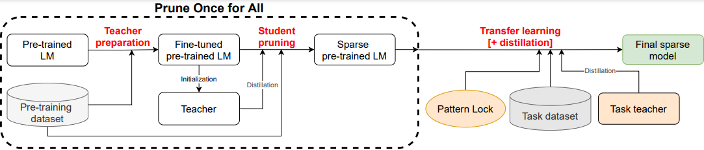

# BERT-Large Prune OFA - Prune Once for All: Sparse Pre-Trained Language Models

Prune OFA (Prune Once for All) is an architecture-agnostic method for producing sparse pre-trained language models. 
These sparse pre-trained models can be later fine-tuned to downstream tasks with minimal accuracy loss at high sparsity ratios, removing the burden of pruning and tuning for a specific language task.
A visualization of our method is presented in Figure 1.

This method was presented in an ENLSP@NeurIPS2021 [paper](https://arxiv.org/abs/2111.05754).


<figure>

<figcaption> Figure 1: Prune OFA method visualization </figcaption>
</figure>

### Pre-Training a Sparse Language Model

The method takes as an input a pre-trained language model, a large text corpus as a pre-training dataset, and outputs a sparse language model of the same architecture. 
The method consists of two steps, teacher preparation and student pruning. 

#### Teacher preparation

The first step of Prune OFA is to obtain a model optimized on a pre-training task (e.g. masked language modeling) using the pre-training dataset. 
The same dataset will be used for pruning the student in the next step. 
This model will initialize the student and teacher models in the student pruning step. 

#### Student pruning

A student model is initialized from the model prepared in the teacher preparation step. 
The student is then fine-tuned on a linear combination of the pre-training task, and the knowledge distillation objective while being pruned.
The output model of this process is a sparse pretrained language model.

### Fine-Tuning

Fine-tuning of a sparse pre-trained language model is the same as fine-tuning a dense pre-trained model with one difference.
A sparsity mask is initialized for the model in order to keep the model's sparsity pattern in-place while optimizing the non-zero model's weights.
Knowledge distillation from a task specific teacher can enhance the results further.

## Creating BERT-Large-PruneOFA

To create BERT-Large-PruneOFA we took used [BERT-Large-uncased](https://huggingface.co/bert-large-uncased) pre-trained model and [English Wikipedia](https://huggingface.co/datasets/wikipedia) and [BookCorpus](https://huggingface.co/datasets/bookcorpusopen) as the pre-training dataset.
Then we performed the same process described in the original paper using the same hyper-parameters.
The model was trained to 80% block structured sparsity to maximize the performance of the model on the target hardware.

The model was trained using the implementation available in [IntelLabs/Model-Compression-Research-Package](https://github.com/IntelLabs/Model-Compression-Research-Package) on 8xNVIDIA Tesla-A100 + 2xIntel(R) Xeon(R) Platinum 8280 system.

## Fine-Tuning BERT-Large-PruneOFA to SQuADv1.1

To fine-tune BERT-Large-PruneOFA to SQuADv1.1 question answering task we use [NeuralMagic/SparseML](https://github.com/neuralmagic/sparseml), an open-source toolkit that applies sparsification algorithms such as pruning and quantization to neural networks.
The model is fine-tuned to SQuADv1.1 and quantized using quantization-aware training and knowledge distillation.
Additional information on fine-tuning the model is available [here](https://sparsezoo.neuralmagic.com/models/nlp%2Fquestion_answering%2Fbert-large%2Fpytorch%2Fhuggingface%2Fsquad%2Fpruned80_quant-none-vnni).

BERT-Large-PruneOFA can be fine-tuned to SQuADv1.1 using the following commands:

```bash
pip install sparseml[torch]

sparseml.transformers.train.question_answering \
  --output_dir bert_large_uncased-squad \
  --model_name_or_path zoo:nlp/masked_language_modeling/bert-large/pytorch/huggingface/wikipedia_bookcorpus/pruned80-none-vnni \
  --distill_teacher zoo:nlp/question_answering/bert-large/pytorch/huggingface/squad/base-none \
  --recipe zoo:nlp/question_answering/bert-large/pytorch/huggingface/squad/pruned80_quant-none-vnni \
  --dataset_name squad \
  --do_train \
  --do_eval \
  --per_device_train_batch_size 8 \
  --per_device_eval_batch_size 32 \
  --gradient_accumulation_steps 4 \
  --preprocessing_num_workers 6 \
  --max_seq_length 384 \
  --doc_stride 128
```

## Inference with Deepsparse Runtime Engine

[Deepsparse](https://neuralmagic.com/deepsparse-engine/) runtime-engine, a sparsity-aware neural network inference engine that delivers, we trained the model with block sparsity in the input dimension of the weights.
The resulted fine-tuned sparse model is compatible with Deepsparse runtime engine.
The model can be exported and deployed using the following commands:

```bash
# Install Deepsparse runtime
pip install deepsparse[server]

# Deploy model with Deepsparse server
deepsparse.server --task question_answering --batch_size 1 --model_path bert_large_uncased-squad
```

## Citation info
If you find our models useful, please consider citing our work:
```bibtex
@article{zafrir2021prune,
  title={Prune Once for All: Sparse Pre-Trained Language Models},
  author={Zafrir, Ofir and Larey, Ariel and Boudoukh, Guy and Shen, Haihao and Wasserblat, Moshe},
  journal={arXiv preprint arXiv:2111.05754},
  year={2021}
}
```
